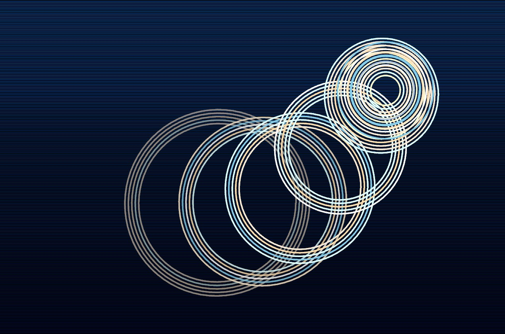

# irRipples

An interactive real-time visual effect application built with the [Nannou](https://nannou.cc/) creative coding framework for Rust. Click or drag your mouse to generate beautiful ripple patterns over a dynamic water-like surface.



## Features

- **Educational Purpose**: Designed as an illustrative Nannou demo and Rust code showcase for learning creative coding
- **Interactive Ripple Effects**: Click or hold the mouse button to create expanding, colorful ripple patterns
- **Dynamic Water Background**: Animated background with shimmering effects and random sparkles
- **High Performance**: Optimized rendering for smooth animations even with multiple ripples
- **Visual Effects**:
  - Multiple concentric rings per ripple
  - Color transitions as ripples expand
  - Opacity fading as ripples reach their maximum size
  - Optional wobble effect for more organic-looking ripples

## Installation

### Prerequisites

- [Rust](https://www.rust-lang.org/tools/install) (latest stable version)
- Required dependencies for Nannou:
  - OpenGL 3.2 or higher
  - Audio drivers (if using audio features)
  - For platform-specific dependencies, see the [Nannou platform setup guide](https://guide.nannou.cc/getting_started/platform-specific_setup.html)

### Steps

1. Clone this repository:
   ```bash
   git clone https://github.com/yourusername/irRipples.git
   cd irRipples
   ```

2. Build and run:
   ```bash
   cargo run --release
   ```

   The `--release` flag is for better performance and is optional.

## Controls

- **Left Click**: Create a ripple at the cursor position
- **Hold Left Button**: Create multiple ripples as you move the cursor
- **Close Window**: Exit the application

## Customization

The project includes several configuration constants in `src/main.rs` that you can modify to change the appearance:

| Constant | Description | Default |
|----------|-------------|---------|
| `AMOUNT` | Maximum number of concentric rings per ripple | 5 |
| `MAX_RADIUS` | Maximum radius before ripple disappears | 200.0 |
| `RADIUS_INCREMENT` | How fast ripples grow | 1.5 |
| `INITIAL_RADIUS` | Starting radius for ripples | 10.0 |
| `COLOR_CHANGE_FACTOR` | Spacing between rings | 7 |
| `ENABLE_WOBBLE` | Enable wobble effect on rings | true |
| `WOBBLE_AMOUNT` | How much rings wobble | 0.8 |
| `ENABLE_FADE` | Enable opacity fade as ripples grow | true |

Color palettes can be modified in `src/effects.rs` by changing the `COLORS` array.

## How It Works

### Main Components

- **Ripple System**: Manages creation, animation, and rendering of ripple effects
- **Water Background**: Generates a dynamic water surface using Perlin noise
- **Event System**: Processes mouse inputs to trigger ripple creation

### Technical Details

- **Rendering**: Uses Nannou's drawing API for efficient GPU-accelerated graphics
- **Animation**: Time-based updates ensure consistent animation speeds
- **Perlin Noise**: Emulates water movement and sparkle effects
- **Color Management**: Supports alpha channel for fade effects

## Development

This project is built with:
- [Nannou](https://github.com/nannou-org/nannou) for creative coding and graphics
- [Noise](https://github.com/razaekel/noise-rs) for Perlin noise algorithms

## Performance Tips

For better performance:
- Always use `--release` mode when running
- Adjust the water background resolution if needed
- On slower systems, reduce the maximum number of ripples or sparkles

## License

[MIT License](LICENSE)